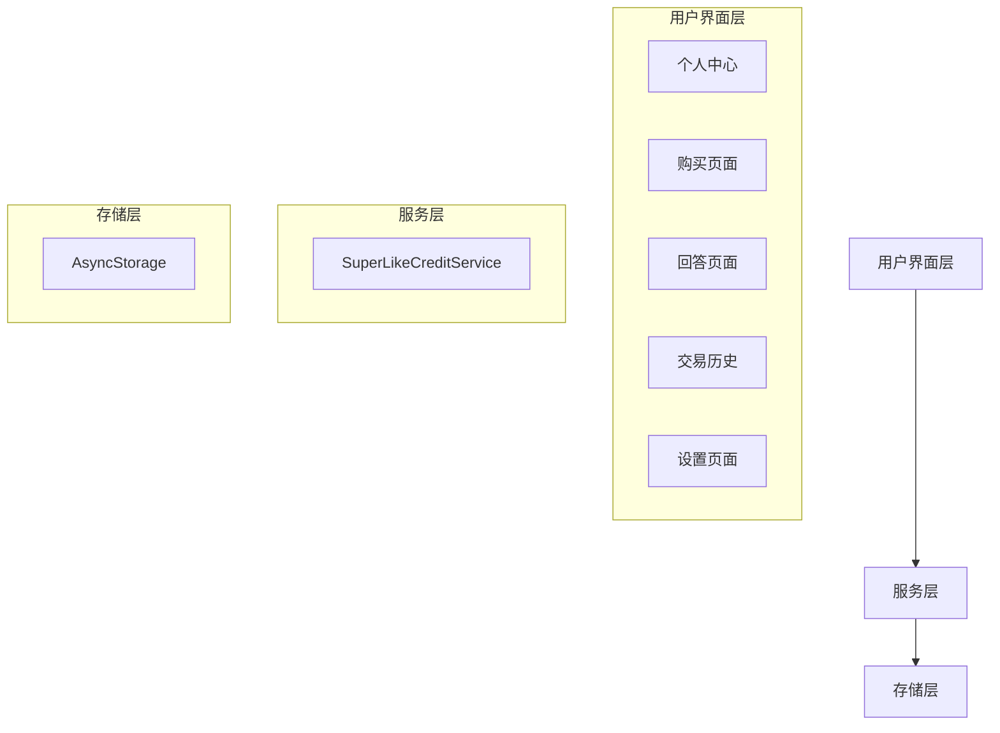

# 设计文档

## 概述

超级赞积分系统将当前绑定特定回答的购买模式重构为基于积分的通用系统。用户可以购买超级赞次数（积分），然后在任意回答上使用这些积分。该系统包括购买、使用、余额管理、交易历史和数据持久化等核心功能。

## 架构

### 系统架构图



### 数据流

1. **购买流程**: 用户界面 → SuperLikeCreditService.purchase() → AsyncStorage
2. **使用流程**: 用户界面 → SuperLikeCreditService.use() → AsyncStorage
3. **查询流程**: 用户界面 → SuperLikeCreditService.getBalance() → AsyncStorage
4. **历史流程**: 用户界面 → SuperLikeCreditService.getHistory() → AsyncStorage

## 组件和接口

### 1. SuperLikeCreditService

核心服务类，负责所有超级赞次数的业务逻辑。

```javascript
class SuperLikeCreditService {
  // 获取当前余额
  async getBalance(): Promise<number>
  
  // 购买超级赞次数
  async purchase(amount: number): Promise<PurchaseResult>
  
  // 使用超级赞
  async use(answerId: string): Promise<UseResult>
  
  // 获取交易历史
  async getHistory(): Promise<Transaction[]>
  
  // 初始化（应用启动时调用）
  async initialize(): Promise<void>
  
  // 迁移旧数据（仅在升级时调用一次）
  async migrateOldData(): Promise<void>
}

interface PurchaseResult {
  success: boolean
  newBalance: number
  transaction: Transaction
  error?: string
}

interface UseResult {
  success: boolean
  newBalance: number
  transaction: Transaction
  error?: string
}

interface Transaction {
  id: string
  type: 'purchase' | 'use'
  amount: number
  timestamp: number
  answerId?: string  // 仅在type='use'时存在
  answerTitle?: string  // 仅在type='use'时存在
}
```

### 2. 购买页面组件 (SuperLikePurchaseScreen)

替代现有的 BuySuperLikeScreen，提供统一的购买入口。

**主要功能：**
- 显示当前余额
- 提供快速选择购买数量（5, 10, 20, 50, 100）
- 支持自定义输入数量
- 实时显示价格计算
- 完成购买并更新余额

**Props：**
```javascript
{
  navigation: NavigationProp
}
```

### 3. 交易历史页面 (SuperLikeHistoryScreen)

显示所有购买和使用记录。

**主要功能：**
- 显示所有交易记录
- 按时间倒序排列
- 区分购买和使用类型
- 显示交易详情（数量、时间、相关回答）

**Props：**
```javascript
{
  navigation: NavigationProp
}
```

### 4. 余额显示组件 (SuperLikeBalance)

可复用的余额显示组件，用于多个页面。

**Props：**
```javascript
{
  size?: 'small' | 'medium' | 'large'
  showLabel?: boolean
  onPress?: () => void  // 点击跳转到购买页面
}
```

### 5. 使用超级赞按钮组件 (UseSuperLikeButton)

用于回答页面的使用按钮。

**Props：**
```javascript
{
  answerId: string
  answerTitle: string
  currentSuperLikes: number
  onSuccess?: () => void
}
```

## 数据模型

### 存储键

```javascript
const STORAGE_KEYS = {
  BALANCE: '@superlike_balance',
  TRANSACTIONS: '@superlike_transactions',
  MIGRATION_FLAG: '@superlike_migrated'
}
```

### 数据结构

**余额数据：**
```javascript
{
  balance: number  // 当前可用次数
}
```

**交易历史数据：**
```javascript
[
  {
    id: string,
    type: 'purchase' | 'use',
    amount: number,
    timestamp: number,
    answerId?: string,
    answerTitle?: string
  },
  ...
]
```

## 正确性属性

*属性是一个特征或行为，应该在系统的所有有效执行中保持为真——本质上是关于系统应该做什么的正式声明。属性作为人类可读规范和机器可验证正确性保证之间的桥梁。*

### 属性 1: 价格计算正确性

*对于任意* 购买数量 n（1 ≤ n ≤ 100），显示的价格应该等于 n × 2

**验证需求: 1.3**

### 属性 2: 购买增加余额

*对于任意* 购买数量 n 和当前余额 b，购买成功后的新余额应该等于 b + n

**验证需求: 1.4**

### 属性 3: 使用减少余额

*对于任意* 余额 b > 0，使用超级赞后的新余额应该等于 b - 1

**验证需求: 2.4**

### 属性 4: 回答超级赞计数增加

*对于任意* 回答的当前超级赞计数 c，使用超级赞后的新计数应该等于 c + 1

**验证需求: 2.5**

### 属性 5: 余额为零时禁止使用

*对于任意* 余额为 0 的状态，尝试使用超级赞应该失败并提示购买

**验证需求: 2.2, 2.3**

### 属性 6: 交易记录完整性

*对于任意* 购买或使用操作，交易历史中应该创建一条包含类型、数量、时间戳的记录

**验证需求: 1.5, 2.6**

### 属性 7: 交易历史排序

*对于任意* 交易历史列表，记录应该按时间戳倒序排列（最新的在前）

**验证需求: 5.5**

### 属性 8: 数据持久化往返

*对于任意* 余额值和交易历史，保存到 AsyncStorage 后再加载应该得到相同的值

**验证需求: 6.1, 6.2, 6.3, 6.4**

### 属性 9: 余额和交易历史的一致性

*对于任意* 交易历史，通过重放所有交易计算出的余额应该等于存储的余额值

**验证需求: 1.4, 2.4**

## 错误处理

### 购买错误

1. **无效数量**: 数量 < 1 或 > 100
   - 错误消息: "请输入有效的购买数量（1-100）"
   - 处理: 阻止购买，显示错误提示

2. **存储失败**: AsyncStorage 写入失败
   - 错误消息: "购买失败，请稍后重试"
   - 处理: 回滚操作，不更新余额

### 使用错误

1. **余额不足**: 余额 = 0
   - 错误消息: "超级赞次数不足，是否购买？"
   - 处理: 显示购买提示对话框

2. **存储失败**: AsyncStorage 写入失败
   - 错误消息: "使用失败，请稍后重试"
   - 处理: 回滚操作，不更新余额和回答计数

### 加载错误

1. **数据损坏**: JSON 解析失败
   - 处理: 使用默认值（余额=0，交易历史=[]）
   - 记录错误日志

2. **存储不可用**: AsyncStorage 不可访问
   - 处理: 使用内存缓存，显示警告
   - 记录错误日志

## 测试策略

### 单元测试

使用 Jest 进行单元测试，覆盖以下场景：

1. **SuperLikeCreditService 测试**
   - 购买功能：有效数量、无效数量、边界值
   - 使用功能：余额充足、余额不足
   - 余额查询：初始状态、购买后、使用后
   - 交易历史：记录创建、排序、查询

2. **组件测试**
   - SuperLikePurchaseScreen：UI 渲染、用户交互
   - SuperLikeHistoryScreen：数据显示、排序
   - SuperLikeBalance：余额显示、点击事件
   - UseSuperLikeButton：按钮状态、点击处理

3. **边界情况测试**
   - 余额为 0 时使用
   - 购买最小值（1）和最大值（100）
   - 空交易历史
   - 数据迁移

### 属性测试

使用 fast-check 进行属性测试（每个测试至少 100 次迭代）：

1. **属性 1**: 价格计算
   - 生成随机购买数量（1-100）
   - 验证价格 = 数量 × 2

2. **属性 2**: 购买增加余额
   - 生成随机初始余额和购买数量
   - 验证新余额 = 旧余额 + 购买数量

3. **属性 3**: 使用减少余额
   - 生成随机初始余额（> 0）
   - 验证新余额 = 旧余额 - 1

4. **属性 4**: 回答超级赞计数增加
   - 生成随机初始计数
   - 验证新计数 = 旧计数 + 1

5. **属性 8**: 数据持久化往返
   - 生成随机余额和交易历史
   - 验证保存后加载的值相同

6. **属性 9**: 余额和交易历史一致性
   - 生成随机交易历史
   - 验证重放交易后的余额正确

### 集成测试

1. **完整购买流程**
   - 打开购买页面 → 选择数量 → 确认购买 → 验证余额更新

2. **完整使用流程**
   - 打开回答页面 → 点击使用超级赞 → 验证余额减少和回答计数增加

3. **余额不足流程**
   - 余额为 0 → 尝试使用 → 显示购买提示 → 跳转购买页面

4. **交易历史流程**
   - 执行多次购买和使用 → 打开历史页面 → 验证记录完整和排序正确

## 国际化

### 翻译键

在 `src/i18n/locales/zh.json` 和 `src/i18n/locales/en.json` 中添加以下键：

```json
{
  "superLike": {
    "title": "超级赞",
    "balance": "余额",
    "credits": "次",
    "purchase": {
      "title": "购买超级赞",
      "currentBalance": "当前余额",
      "selectAmount": "选择购买数量",
      "customAmount": "或输入自定义数量",
      "minAmount": "最少 1 个",
      "unitPrice": "单价",
      "quantity": "购买数量",
      "total": "总计",
      "confirmButton": "立即购买 {amount} 个超级赞",
      "cancelButton": "取消",
      "successTitle": "购买成功",
      "successMessage": "成功购买 {amount} 个超级赞！\n花费：${cost}\n您可以在任意回答上使用它们！",
      "errorInvalidAmount": "请输入有效的购买数量（1-100）",
      "errorStorageFailed": "购买失败，请稍后重试"
    },
    "use": {
      "button": "使用超级赞",
      "confirmTitle": "使用超级赞",
      "confirmMessage": "确认使用 1 次超级赞提升此回答的排名？",
      "successTitle": "使用成功",
      "successMessage": "已使用 1 次超级赞！\n剩余：{balance} 次",
      "errorInsufficientBalance": "超级赞次数不足",
      "errorInsufficientBalanceMessage": "您的超级赞次数不足，是否购买？",
      "errorStorageFailed": "使用失败，请稍后重试"
    },
    "history": {
      "title": "交易历史",
      "empty": "暂无交易记录",
      "typePurchase": "购买",
      "typeUse": "使用",
      "amount": "{amount} 次",
      "usedOn": "用于回答：{title}"
    }
  }
}
```

## 迁移策略

### 数据迁移

在应用启动时检查是否需要迁移：

1. 检查迁移标志 `@superlike_migrated`
2. 如果未迁移，执行以下步骤：
   - 扫描所有回答的超级赞数据（如果有）
   - 保留回答的超级赞计数（不改变）
   - 初始化用户余额为 0
   - 设置迁移标志为 true

### 代码迁移

1. **移除旧文件**
   - 删除 `src/screens/BuySuperLikeScreen.js`

2. **更新导航**
   - 在 `App.js` 中移除 BuySuperLike 路由
   - 添加 SuperLikePurchase 和 SuperLikeHistory 路由

3. **更新回答页面**
   - 移除绑定特定回答的购买按钮
   - 添加使用超级赞按钮（使用 UseSuperLikeButton 组件）
   - 显示当前余额（使用 SuperLikeBalance 组件）

4. **更新个人中心**
   - 添加超级赞余额显示
   - 添加购买入口按钮
   - 添加交易历史入口按钮

5. **更新设置页面**
   - 添加购买超级赞入口

## 性能考虑

1. **缓存策略**
   - 在内存中缓存余额，减少 AsyncStorage 读取
   - 仅在余额变化时更新缓存

2. **批量操作**
   - 交易历史使用分页加载（每页 20 条）
   - 避免一次性加载所有历史记录

3. **异步操作**
   - 所有 AsyncStorage 操作使用 async/await
   - 避免阻塞 UI 线程

## 安全考虑

1. **数据验证**
   - 购买数量：1-100
   - 余额：非负整数
   - 交易记录：必需字段验证

2. **错误恢复**
   - 存储失败时回滚操作
   - 数据损坏时使用默认值
   - 记录错误日志便于调试

3. **数据一致性**
   - 使用事务性操作（先验证，再更新）
   - 余额和交易历史同步更新
   - 定期验证数据一致性
